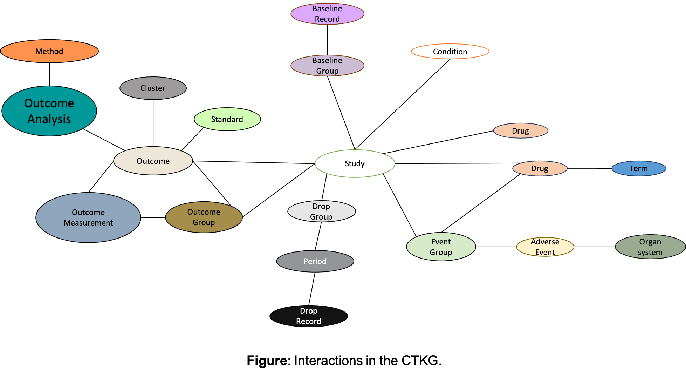

<!-- md-toc-begin -->
# Contents
- [Clinical Trial Knowledge Graph (CTKG)](#clinical-trial-knowledge-graph-ctkg)
- [Nodes](#nodes)
   - [1. Study](#1-study)
   - [2. Drug](#2-drug)
   - [3. Term](#3-term)
   - [4. Condition](#4-condition)
   - [5. OutcomeGroup](#5-outcomegroup)
   - [6. Outcome](#6-outcome)
   - [7. StandardOutcome](#7-standardoutcome)
   - [8. ClusterOutcome](#8-clusteroutcome)
   - [9. OutcomeMeasure](#9-outcomemeasure)
   - [10. OutcomeAnalysis](#10-outcomeanalysis)
   - [11. Method](#11-method)
   - [12. BaselineGroup](#12-baselinegroup)
   - [13. BaselineRecord](#13-baselinerecord)
   - [14. EventGroup](#14-eventgroup)
   - [15. AdverseEvent](#15-adverseevent)
   - [16. Organ](#16-organ)
   - [17. DropGroup](#17-dropgroup)
   - [18. Period](#18-period)
   - [19. DropRecord](#19-droprecord)
- [Relations](#relations)
   - [1. study-useddrug relation](#1-study-useddrug-relation)
   - [2. study-studieddrug relation](#2-study-studieddrug-relation)
   - [3. Study-Condition relation](#3-study-condition-relation)
   - [4. Drug-Term relation](#4-drug-term-relation)
   - [5. Drug-EventGroup relation](#5-drug-eventgroup-relation)
   - [6. Study-OutcomeGroup relation](#6-study-outcomegroup-relation)
   - [7. Study-Outcome relation](#7-study-outcome-relation)
   - [8. Outcome-ClusterOutcome relation](#8-outcome-clusteroutcome-relation)
   - [9. Outcome-StandardOutcome relation](#9-outcome-standardoutcome-relation)
   - [10. Outcome-OutcomeAnalysis relation](#10-outcome-outcomeanalysis-relation)
   - [11. OutcomeAnalysis-Method relation](#11-outcomeanalysis-method-relation)
   - [12. OutcomeAnalysis-OutcomeGroup relation](#12-outcomeanalysis-outcomegroup-relation)
   - [13. Outcome-OutcomeMeasure relation](#13-outcome-outcomemeasure-relation)
   - [14. OutcomeMeasure-OutcomeGroup relation](#14-outcomemeasure-outcomegroup-relation)
   - [15. Study-BaselineGroup relation](#15-study-baselinegroup-relation)
   - [16. BaselineGroup-BaselineRecord relation](#16-baselinegroup-baselinerecord-relation)
   - [17. Study-EventGroup relation](#17-study-eventgroup-relation)
   - [18. EventGroup-AdverseEvent relation](#18-eventgroup-adverseevent-relation)
   - [19. AdverseEvent-Organ relation](#19-adverseevent-organ-relation)
   - [20. Study-DropGroup relation](#20-study-dropgroup-relation)
   - [21. DropGroup-Period relation](#21-dropgroup-period-relation)
   - [22. Period-DropRecord relation](#22-period-droprecord-relation)
<!-- md-toc-end -->

# Clinical Trial Knowledge Graph (CTKG)

Clinical Trial Knowledge Graph (CTKG) is a comprehensive knowledge graph relating clinical studies, study groups, drugs, conditions, adverse events, outcome analyses and outcomes. CTKG represents information from the [AACT](https://aact.ctti-clinicaltrials.org/connect) database as a knowledge graph to capture the relations among nodes. CTKG includes 1,504,294 nodes belonging to 19 node-types; and **7,349,016** triplets belonging to 22 relation-types. These 22 relation-types show a type of interaction between one of the 19 node-type pairs as depicted in the figure below.  In CTKG, we have two types of relations between the study and drug nodes. For the rest of the node-type pairs, we have at most one relation for each of them.

# Nodes

The following table shows the description and attributes for each node type. We list the brief definition of attributes. Please refer to this [!link](https://prsinfo.clinicaltrials.gov/results_definitions.html) for detailed definitions.

## 1. Study

Each *study* node represents a clinical study. Clinical studies study the effect of drugs in treating conditions. CTKG includes 8,210 clinical *study* nodes. Each *study* node has 49 attributes and an id "StudyID:NCTXXX". 

**Attributes:**

1. **last_update_submitted_qc_date**

   Definition: the date that the last update was submitted 

   Example: 2020-04-10

2. **last_update_posted_date** 

   Definition: The estimated or actual date on which the last update was posted 

   Example: 2020-04-21

3. **last_update_posted_date_type**: Actual/Estimate

   Definition: This attribute shows the last update posted date is actual or estimated.

   > Statistics:
   >
   > 4,424 (53.9%) Actual
   >
   > 3,786 (46.1%) Estimate

4. **start_date_type**:  Actual/"" 

   Definition: This attribute shows the start date is actual or estimated.

   > Statistics: 
   >
   > 5,774 (70.3%) ""
   >
   > 2,436 (29.7%) Actual

5. **start_date** 

   Definition: The estimated date on which the clinical study will be open for recruitment of participants, or the actual date on which the first  participant was enrolled.

   Example: 2017-07-01

6. **verification_month_year** 

   Definition: The date on which the responsible party last verified the clinical study information in the entire ClinicalTrials.gov record for the clinical  study, even if no additional or updated information is being submitted.

   Example: April 2020

7. **verification_date** 

   Example: 2020-04-30

8. **primary_completion_date_type**: Actual/Anticipated/"" 

   Definition: This attribute shows the primary completion date is actual or estimated.

   > Statistics: 
   >
   > 8,188 (99.7%) Actual
   >
   > 19 "" 
   >
   > 3 Anticipated

9. **primary_completion_date**

   Definition: The date that the final participant was examined or received an intervention for the purposes of final collection of data for the primary outcome, whether the clinical study concluded according to the pre-specified protocol or was terminated. In the case of clinical studies with more than one primary outcome measure with different completion dates, this term refers to the date on which data collection is completed for all of the primary outcomes.

   Example: 2018-07-15

10. **target_duration**

    Definition: For Patient Registries, the anticipated time period over which each  participant is to be followed. Provide a number and select a Unit of  Time (years, months, weeks, days). 

    > Statistics: 
    >
    > 8,209 (99.9%) ""
    >
    >  1               7 Days

11. **study_type** 

    Definition: The nature of the investigation or investigational use for which clinical study information is being submitted.

    > Statistics: 
    >
    > 8,078 (98.4%) Interventional 
    >
    > 131   (1.6%) Observational       
    >
    > 1    (0.0%) Observational [Patient Registry]

12. **brief_title**

    Definition: A short title of the clinical study written in language intended for the lay public.

    Example: "Study of Naltrexone-Induced Blockade of Antidepressant Effects"

13. **official_title**

    Definition: The title of the clinical study, corresponding to the title of the protocol.

    Example: "Naltrexone-induced Blockade of Neural Responses Induced by Fast-Acting Antidepressant Effects"

14. **overall_status**: Completed/Terminated/Active, not recruiting/Unknown status/Recruiting 

    Definition: The recruitment status for the clinical study as a whole, based upon the status of the individual sites. If at least one facility in a  multi-site clinical study has an Individual Site Status of "Recruiting," then the Overall Recruitment Status for the study must be "Recruiting."

    > Statistics: 
    >
    > 7,325 (89.2%) Completed
    >
    > 560 (6.8%) Terminated
    >
    > 311 (3.8%) Active, not recruiting
    >
    > 12 Unknown status
    >
    > 2 Recruiting

15. **phase** 

    Definition: For a clinical trial of a drug product (including a biological product), the numerical phase of such clinical trial, consistent with terminology in 21 CFR 312.21 and in 21 CFR 312.85 for phase 4 studies.

    Example: Phase 3

    > Statistics:
    >
    > 3,507 (42.7%) Phase 3
    > 1,984 (24.2%) Phase 2
    > 1,409 (17.2%) Phase 4
    > 424   (5.2%) N/A
    > 345   (4.2%) Phase 1
    > 218   (2.7%) Phase 1/Phase 2
    > 175   (2.1%) Phase 2/Phase 3
    > 132   (1.6%) ""
    > 16   (0.2%) Early Phase 1

16. **enrollment**

    Definition:  The estimated total number of participants to be enrolled (target  number) or the actual total number of participants that are enrolled in  the clinical study.

    Example: 60

17. **enrollment_type**: Actual/Anticipated

    Definition: This attribute shows the total number of participants to be enrolled is estimated or actual.

    > Statistics: 
    >
    > 8,209 (99.9%) Actual
    >
    >   1 Anticipated

18. **source** 

    Definition: This attribute shows the institute which conducts the clinical study.

    Example: University of Pittsburgh

    > Statistics: 
    >
    > 956 unique institutes in total
    >
    > 218 of them are in more than 5 institutes

19. **number_of_arms**

    Definition: The number of arms in the clinical trial. For a trial with multiple  periods or phases that have different numbers of arms, the maximum  number of arms during all periods or phases. "Arm" means a pre-specified group or subgroup of participant(s) in a  clinical trial assigned to receive specific intervention(s) (or no  intervention) according to a protocol. 

    Example: 2

20. **number_of_groups** 

    Definition: Number of study groups/cohorts. Enter "1" for a single-group study. Many observational studies have one group/cohort; case control studies  typically have two.

    Example: 2

    > Statistics: 8,081(98.4%) ""

21. **why_stoped** 

    Definition: A brief explanation of the reason(s) why such clinical study was stopped (for a clinical study that is "Suspended," "Terminated," or "Withdrawn" prior to its planned completion as anticipated by the protocol).

    Example: "Lack of efficacy"

    > Statistics: 7,729 (94.1%) ""

22. **allocation**

    Definition: The method by which participants are assigned to arms in a clinical trial. 

    Example: "Randomized"   

    >  Statistics: 
    >
    >  7,019 (85.5%) Randomized
    >  602   (7.3%) N/A
    >  406   (4.9%) Non-Randomized (i.e., Participants may choose which group they want to be in, or they may be assigned to the groups by the    researchers.)
    >  183   (2.2%) ""

23. **intervention_model** 

    Definition: The strategy for assigning interventions to participants.

    Example: "Parallel Assignment" 

    > Statistics: 
    >
    > 6,308 (76.8%) Parallel Assignment (i.e., participants are assigned to one of two or more groups in parallel for the duration of the study)
    > 879 (10.7%) Single Group Assignment (i.e., clinical trials with a single arm)
    > 742   (9.0%) Crossover Assignment (i.e., groups of participants receive two or more interventions in a specific order.)
    > 167   (2.0%) ""
    > 93   (1.1%) Factorial Assignment (i.e., groups of participants receive one of several combinations of interventions)
    > 21   (0.2%) Sequential Assignment

24. **primary_purpose**

    Definition: The main objective of the intervention(s) being evaluated by the clinical trial. 

    Example: "Treatment"

    > Statistics:  
    >
    > 7,069 (86.1%) Treatment
    > 453   (5.5%) Prevention
    > 221   (2.7%) ""
    > 145   (1.8%) Basic Science
    > 138   (1.7%) Supportive Care
    > 93   (1.1%) Other
    > 71   (0.9%) Diagnostic
    > 16   (0.2%) Health Services Research
    > 4   (0.0%) Screening

25. **time_perspective**: Prospective/Retrospective/Cross-Sectional 

    Definition: Temporal relationship of observation period to time of participant enrollment.

    > Statistics: 8,080 (98.4%) ""

26. **masking**

    Definition: The party or parties involved in the clinical trial who are prevented  from having knowledge of the interventions assigned to individual  participants. 

    Example: Double

    > Statistics:   
    >
    > 2,771 (33.8%) None (Open Label)
    > 1,986 (24.2%) Double
    > 1,982 (24.2%) Quadruple
    > 990 (12.1%) Triple
    > 310   (3.8%) Single
    > 171   (2.1%) ""

27. **masking_description**  

    Definition: Provide information about other parties who may be masked in the clinical trial, if any.

    Example: "This is a phase 4 double blind study, which will use a triple dummy design for dosing."

    > Statistics: 8,074 (98.3%) ""

28. **intervention_model_description** 

    Definition: Provide details about the Interventional Study Model.

    Example:  "Phase I clinical trial, controlled, of parallel groups, double blind, randomized, exploratory."

    > Statistics: 8,080 (98.4%) ""

29. **subject_masked**: t/""

    Definition: True if participants are prevented from having knowledge of the interventions assigned to individual participants.

    > Statistics: 4,844 (59.0%) t and 3,366 (41.0%) ""

30. **caregiver_masked**: t/""

    Definition: True if caregivers are prevented from having knowledge of the interventions assigned to individual participants. 

    > Statistics: 2,614 (31.8%) t and 5,596 (68.2%) ""

31. **investigator_masked**: t/""

    Definition: True if investigators are prevented from having knowledge of the interventions assigned to individual participants.

    > Statistics: 4,718 (57.5%) t and 3,492 (42.5%) ""

32. **outcomes_assessor_masked**: t/""

    Definition: True if outcomes assessors are prevented from having knowledge of the interventions assigned to individual participants.

    > Statistics: 2,613 (31.8%) t and 5,597 (68.2%) ""

33. **sampling_method**: Probability Sample/Non-Probability Sample

    Definition: Indicate the method used for the sampling approach and explain in the Detailed Description.

    > Statistics: 8,078 (98.4%) ""

34. **gender**: All/Female/Male

    Definition: This attribute shows the acceptable gender for the clinical study.

    > Statistics: 
    >
    > 7,256 (88.4%) All
    >
    > 654   (8.0%) Female
    >
    > 300   (3.7%) Male

35. **minimum_age**

    Definition: This attribute shows the minimum acceptable age of participants for the clinical study.

    Example: 18 Years

36. **maximum_age**

    Definition: This attribute shows the maximum acceptable age of participants for the clinical study

    Example:  65 Years

37. **healthy_volunteers**: No/"Accepts Healthy Volunteers"

    Definition: Indication that participants who do not have a disease or condition, or  related conditions or symptoms, under study in the clinical study are  permitted to participate in the clinical study.

    > Statistics: 
    >
    > 7,462 (90.9%) No
    >
    > 732  (8.9%) "Accepts Healthy Volunteers"
    >
    > 16 ""
    
38. **population** 

    Definition: A description of the population from which the groups or cohorts will be selected (for example, primary care clinic, community sample, residents of a certain town).

    Example: "Korean patients with T2DM"

    >  Statistics: 8,078 (98.4%) ""

39. **criteria**

    Definition: A limited list of criteria for selection of participants in the clinical study, provided in terms of inclusion and exclusion criteria and suitable for assisting potential participants in identifying clinical  studies of interest. 

    Example: "~ Inclusion Criteria:  A subject must be 12 years of age or older, ..." (inclusion and exclusion criterion)

40. **gender_description** 

    Definition: If eligibility is based on gender, provide descriptive information about Gender criteria.

    Example: "Androgenetic Alopecia in Males"

    > Statistics: 8,198 (99.9%) ""

41. **gender_based**: t/"" (True of "")

    Definition: If applicable, indicate whether participant eligibility is based on gender.

    > Statistics: 29 t and 8,181 (99.6%) ""

42. **description** 

    Definition: a description of the clinical study

    Example: "The primary objective of the study is to determine whether armodafinil treatment..."

43. **id_type**: org_study_id/secondary_id/nct_alias

    Definition: This attribute indicates if the corresponding id value is the organization's Unique Protocol Identification Number or a number assigned by other publicly available clinical trial registries.  

    > Statistics: 
    >
    > 8,210 (100%) studies have org_study_id 
    >
    > 4,078 (49.7%) studies have secondary_id
    >
    > 202   (2.5%) studies have nct_alias 

44. **id_value** 

    Example: "0000-072;2007_650"

45. **pmid** 

    Definition: PubMed Unique Identifier

    Example: "15292498;11025867;16670414;1003364"

46. **reference_type**: reference/results_reference

    Definition: This attribute indicates if the reference is a bibliographic reference or a reference provided reports on results from this clinical study.

    Definition: 

    > Statistics: 
    >
    > 2,295 studies have 8,297 references (i.e., reference+results_reference). 
    >
    > 5,683 reference and 2,614 results_reference 
    >
    > Each study has 3.6 references on average.

## 2. Drug

Each *drug* node represents a drug name extracted from the intervention or group title/description of clinical studies. CTKG includes 4,617 *drug* nodes. Each *drug* node has an id "DrugID:XXX" and 1 attribute.

**Attributes**:

1. **name** 

   Definition: the drug name extracted from the intervention or group title/description of clinical studies.
   
   Example: "bicalutamide"

## 3. Term

Each *term* node represents a normalized or standard drug name. CTKG includes 2,751 *term* nodes. Each *term* node has an id "TermID:XXX" and 1 attribute.

**Attributes**:

1. **name**

   Definition: the normalized or standard drug name.
   
   Example: "Bicalutamide"

## 4. Condition

Each *condition* node represents a condition/disease studied in clinical studies. CTKG includes 1,394 *condition* nodes. Each *condition* node has an id "ConditionID:XXX" and 1 attribute.

**Attributes**:

1. **name** 

   Definition: the name of the condition/disease studied in the clinical study
   
   Example: "Fever"
   
   

## 5. OutcomeGroup

Each *OutcomeGroup* node represents an arm or a comparison group for describing the outcomes of a study. The groups are based on the pre-specified protocol and/or statistical analysis plan. CTKG includes 32,499 *OutcomeGroup* nodes. Each *OutcomeGroup* node has an id "OutcomeGroupID:XXX" and 3 attributes.

**Attributes:**

1. **ctgov_group_code**:

   Definition: The group code provided by ClinicalTrials.gov.

   Example: "O1"

2. **title**

   Definition: Descriptive label used to identify each arm or group.

   Example: "fMRI BOLD Responses in the rACC Cortex (Naltrexone vs Placebo)"

3. **description**

   Definition: Brief description of each arm or group.

   Example: "We examined naltrexone-induced changes in brain signal during the processing of contextual cues by extracting brain responses in the rACC and comparing then during the baseline (placebo only) and the naltrexone session using paired-t test statistical analysis."

## 6. Outcome

Each *Outcome* node represents an variable that is monitored during a study to document the impact that a given intervention or exposure has on the health of a given population[^1]. CTKG includes 88,386 *Outcome* nodes. Each *Outcome* node has an id "Outcome:XXX" and 4 attributes.

**Attributes:**

1. **type**

   Definition: The type of the outcome node, selected from 4 types below (i.e., "Primary", "Secondary", "Other Pre-specified Outcomes", "Post-Hoc").  The primary outcome is the variable that is the most relevant to answer the research question, and thus ideally should be patient-centered[^1]. The secondary outcome is the additional outcome monitored to help interpret the results of the primary outcome.[^1]

   > Statistics:
   >
   > 70,171  (79.4%)  Secondary
   >
   > 15,534  (17.6%)  Primary
   >
   >     2,830    (3.2%)   Other Pre-specified Outcomes
   >
   > ​     289    (0.3%)   Post-Hoc

2. **title**

   Definition: Name of the specific outcome.

   Example: "Naltrexone-induced Changes in BOLD Responses in the rACC Cortex During the Processing of Contextual Cues"

3. **description**

   Definition: Name of the specific outcome.

   Example: "In order to identify naltrexone-induced changes in the neural correlates of contextual processing, ..."

4. **time_frame**

   Definition: Time point(s) at which the outcome is assessed for the specific metric used.

   Example: "[Approximately at day 1, 7]"

   

## 7. StandardOutcome

Each *StandardOutcome* node represents a standard variable that can be commonly used in clinical studies. In CTKG, these *StandardOutcome* nodes are extracted from the abbreviations in the outcome titles and descriptions. Those abbreviations unrelated with the outcomes have been manually filtered. Similar phrases (e.g., "visual analog pain score" and "visual analogue pain scales") identified from the abbreviations (e.g., "VAS") have been manually merged. The CTKG includes 492 *StandardOutcome* nodes. Each *StandardOutcome* node has an id "StandardOutcomeID:XXX" and 1 attribute.

**Attributes:**

1. **name**

   Definition: The name of the *StandardOutcome* Node.
   
   Example: "blood oxygen level dependent"

## 8. ClusterOutcome

Each *ClusterOutcome* node represents a cluster that is identified from the titles of *Outcome* nodes using the repeated bisection clustering algorithm in CLUTO. For each title, a set of words including noun, adv, verb and adj is extracted to compute the TF-IDF vector. These calculated TF-IDF vectors are further clustered into 200 clusters. The CTKG includes 200 *ClusterOutcome* nodes. Each *ClusterOutcome* node has an id "ClusterOutcomeID:XXX" and 5 attributes.

**Note**: Among 88,386 outcome titles, 142 (0.16%) outcome titles are with only abbreviations (e.g., "GAD-7" or "IL-6"). These outcome titles don't contain any meaningful words and thus cannot be represented by the TF-IDF vectors for clustering. 

**Attributes:**

 1. **size**

    Definition: The number of outcome titles in the specific cluster. The size of clusters range from 86 to 1,493.

 2. **ISim**

    Definition: The average similarity between the objects of each cluster (i.e., internal similarities)

 3. **ESim**

    Definition: The average similarity of the objects of each cluster and the rest of the objects (i.e., external similarities).

 4. **discriptive**

    Definition: The set of five descriptive features is determined by selecting the columns that contribute the most to the average similarity between the objects of each cluster.

    Example:

    "circumference~56.4%,waist~43.0%,head~0.1%,abdominal~0.1%,change~0.1%"

 5. **discriminating**

    Definition: The set of five discriminating features is determined by selecting the columns that are more prevalent in the cluster compared to the rest of the objects.

    Example:

    "circumference~28.6%,waist~21.7%,survival~1.5%,response~1.4%,event~1.1%"

    

## 9. OutcomeMeasure

Each *OutcomeMeasure* node represents an outcome measurement of an variable (i.e., *Outcome* node) on an arm or a group (i.e., *OutcomeGroup* node). The CTKG includes 690,626 *OutcomeMeasure* nodes. Each *OutcomeMeasure* node has an id "OutcomeMeasureID:XXX" and 9 attributes.

**Attributes:**

1. **classification**

   Definition: The outcome measurement may fall into different categories (e.g., different time periods or metric levels).

   Example: "At week 24", "At week 12", "At week 24 with baseline MGI >2.00", "At week 24 with baseline MGI <=2.00" ;  "Green lissamine grade 4", "Green lissamine grade 3", "Green lissamine grade 2".

   Statistics: 142,515 (20.6%) ""

2. **category**

   Definition: Name of distinct category or row for an outcome measure, if any. 

   Example: "Yes"/"No","No flare up"/"Flare up", "Abnormal CS"/"Abnormal NCS".

   Example with both category and classification properties:

   > ...|Total|No flare up|Acute Increase in Pain Score (Acute Exacerbation of Pain)|...
   >
   > ...|Total|Flare up|Acute Increase in Pain Score (Acute Exacerbation of Pain)|...
   >
   > ...|Day 4|No flare up|Acute Increase in Pain Score (Acute Exacerbation of Pain)|...
   >
   > ...|Day 4|Flare up|Acute Increase in Pain Score (Acute Exacerbation of Pain)|...

   Statistics:  674,127 (97.6%) ""

3. **param_type**

   Definition: The type of data for the outcome measure.

   > Statistics:
   >
   > 253,446      (36.7%)    Number
   >
   > 249,245      (36.1%)    Mean
   >
   >    76,099      (11.0%)    Least Squares Mean
   >
   >    64,858         (9.4%)    Count of Participants
   >
   >    31,243         (4.5%)    Median
   >
   >    14,703         (2.1%)    Geometric Mean
   >
   > ​      665        (0.1%)    Geometric Least Squares Mean
   >
   > ​      261                       Count of Units
   >
   > ​        45                       ""
   >
   > ​        39                        Log mean
   >
   > ​        22                        Other including "age normed" (6), "age & education normed" (6), "g/dL" (5), "ng/mL" (3), "age" (2).

4. **param_value**

   Definition: The measurement value for each *OutcomeMeasure* node on the specific *OutcomeGroup*.

5. **type_dispersion**

   Definition: The statistics used to measure the dispersion of the measurement values.

   > Statistics:
   >
   > 297,612    (43.1%)        "" (may means not applicable)
   >
   > 207,039    (30.0%)      Standard Deviation
   >
   >   98,956    (14.3%)        Standard Error
   >
   >   54,922      (8.0%)        95% Confidence Interval
   >
   >   11,984      (1.7%)        Full Range
   >
   > ​    8,837      (1.3%)        Inter-Quartile Range
   >
   > ​    8,620      (1.2%)        Geometric Coefficient of Variation
   >
   > ​    1,844      (0.3%)        90% Confidence Interval
   >
   > ​       633      (0.1%)        80% Confidence Interval
   >
   > ​       120                         97.5% Confidence Interval
   >
   > 
   >
   > Note that the measure of dispersion is not applicable only if Measure Type is "Number," "Count of Participants," or "Count of Units".

6. **dispersion_value**

   Definition: The measurement value of dispersion for each *OutcomeMeasure* node on the specific *OutcomeGroup*.

   > Statistics:  372,954    (54.0%)    ""

7. **dispersion_lower_limit**

   Definition:  This property is used for reporting the lower limit of the interquartile range or full range.

   > Statistics:  608,820    (88.2%)    ""

8. **dispersion_upper_limit**

   Definition:  This property is used for reporting the upper limit of the interquartile range or full range.

   > Statistics:  608,949    (88.2%)    ""

9. **explanation_na**

   Definition: Explain why outcome measure data are not available, if "NA" is reported for Outcome Measure Data.

   > Statistics: 677,500     (98.1%)   ""

## 10. OutcomeAnalysis

Each *OutcomeAnalysis* node represents the result of scientifically appropriate tests of statistical significance of an outcome variable. The CTKG includes 107,314 *OutcomeAnalysis* nodes. Each *OutcomeAnalysis* node has an id "OutcomeAnalysisID:XXX" and 15 attributes.

**Attributes:**

1. **non_inferiority_type**

   Definition: Identifies the type of analysis.

   > Statistics:
   >
   > 73,743        (68.7%)          Superiority or Other
   >
   > 16,127        (15.0%)          Superiority
   >
   >   8,969           (8.4%)           Other
   >
   >   4,686           (4.4%)           Superiority or Other (legacy)
   >
   >   2,534           (2.4%)           Non-Inferiority or Equivalence
   >
   > ​     780           (0.7%)         Non-Inferiority
   >
   > ​     415           (0.4%)         Equivalence
   >
   > ​       60           (0.1%)         Non-Inferiority or Equivalence (legacy)

2. **non_inferiority_type_description**

   Definition: If the non_inferiority_type is "Non-inferiority" or "Equivalence,", additional details is expected to be provided to describe the selected non_inferiority_type, including details of the power calculation (if not previously provided), definition of non-inferiority or equivalence margin, and other key parameters.

   > Statistics:  101,147      (94.3%)          ""

3. **param_type**

   Definition: The type of data for the outcome analysis.

   Example: "Mechanistic hypothesis: naltrexone will block contextual processing."

   > Statistics:
   >
   > 33,286         (31.0%)        ""
   >
   > 18,792         (17.5%)        Mean Difference (Final Values)
   >
   >   7,580           (7.1%)        LS Mean Difference
   >
   >   5,812           (5.4%)        Odds Ratio (OR)
   >
   >   5,429           (5.1%)        Mean Difference (Net)
   >
   >   5,054           (4.7%)        Hazard Ratio (HR)
   >
   >   
   >
   > 31,361         other types

4. **param_value**

   Definition: The value for each *OutcomeAnalysis* node.

   > Statistics:  33,286          (31.0%)       ""

5. **dispersion_type**

   Definition: The type of the measure of dispersion for the outcome analysis.

   > Statistics:
   >
   > 85,491          (79.7%)       ""
   >
   > 20,547          (19.1%)       Standard Error of the Mean
   >
   >   1,276               (1.2%)      Standard Deviation

6. **dispersion_value**

   Definition: The measure of dispersion for each *OutcomeAnalysis* node.

   > Statistics:  85,491          (79.7%)       ""

7. **p_value_modifier**

   Definition: The modifier of p_value, typically a less than or greater than sign.

   > Statistics:
   >
   > 74,799          (69.7%)       ""
   >
   > 30,444          (28.4%)       <
   >
   >   1,027            (1.0%)        =
   >
   > ​     980            (0.9%)        >
   >
   > ​       64            "<=" (58); "p<" (3); ">=" (2); "NS" (1)

8. **p_value**

   Definition: The p_value of the statistical test that can be used to reject or retain the null hypothesis.

   Statistics:  15,837          (14.8%)       "" 

9. **p_value_description**

   Example: 

10. **confidence_interval_sides**

    Definition: Select 1-sided or 2-sided.

    > Statistics:
    >
    > 62,041          (57.8%)          2-Sided
    >
    > 44,984          (41.9%)          ""
    >
    > ​      289            (0.3%)          1-Sided

11. **confidence_interval_percent**

    > Statistics:
    >
    > 65,209           (60.8%)         95.0
    >
    > 35,614           (33.2%)          ""
    >
    > 4,748              (4.4%)         90.0
    >
    > ​     726              (0.7%)         80.0
    >
    > 
    >
    > 1,017 other numbers

12. **confidence_interval_lower_limit**

    Definition: Required if confidence interval is "2-sided" or if confidence interval is "1-sided" and no Upper Limit is entered.

13. **confidence_interval_upper_limit**

    Definition: Required if confidence interval is "2-sided" or if confidence interval is "1-sided" and no Lower Limit is entered.

14. **estimate_description**

    Definition: Any other relevant estimation information, including the direction of the comparison (for example, describe which arm or comparison group represents the numerator and denominator for relative risk).

    Example: "Difference is first named treatment (experimental) minus second named treatment (control)."

15. **group_description**

    Example: "Changes in BOLD fMRI signal from the Placebo vs. the Naltrexone session."

16. **other_description**

    Example: "The primary analysis was based on concentration-QTc modeling of the relationship ..."

    

## 11. Method

Each *Method* node represents a statistical method that is used in the statistical analyses of outcomes. The CTKG includes 933 *Method* nodes. Each *Method* node has an id "MethodID:XXX" and 1 attribute.

**Attributes:**

1. **name**

   Definition: The name of the statistical method.
   
   Example: "ancova"

## 12. BaselineGroup

Each *BaselineGroup* node represents an arm or a comparison group for describing the demographic or the data collected from the participants in the group. The groups are based on the pre-specified protocol and/or statistical analysis plan. CTKG includes 27,068 *BaselineGroup* nodes. Each *BaselineGroup* node has an id "BaselineGroupID:XXX" and 3 attributes.

**Attributes:**

1. **ctgov_group**

   Definition: The group code provided by ClinicalTrials.gov.

   Example: "O1"

2. **title**

   Definition: Descriptive label used to identify each arm or group.

   Example: "Placebo, Then Naltrexone"

   > Statistics:
   >
   > 6,952 baseline groups (25.68% over all baseline groups) are with the title "Total". These baseline groups are summaries of all the other reporting baseline groups in the studies.
   >
   > 20,116 baseline groups (74.32%) represent a single group of participants.

3. **description**

   Definition: Brief description of each arm or group.

   Example: ""In the placebo and then naltrexone arm, participants receive one-dose of placebo pill one hour before a first fMRI scanning session on visit 1 followed by a one-dose naltrexone 50mg one hour before a second fMRI scanning session on ...."

   

## 13. BaselineRecord

Each *BaselineRecord* node represents a data record of a specific baseline measure (e.g., age, gender, country) collected from the participants in the *BaselineGroup*. CTKG includes 315,533 *BaselineRecord* nodes. Each *BaselineRecord* node has an id "BaselineRecordID:XXX" and 10 attributes.

**Attributes:**

1. **classification**

   Example: "United States"; "Male"; "Female"

   Statistics:  192,923         (61.1%)           ""
   
2. **category**

   Definition: Name of distinct category or row for a baseline measure, if any.

   Example:  "Unknown or Not Reported"; "Not Hispanic or Latino", "Hispanic or Latino","Male"

   Statistics:  172,555          (54.7%)          ""
   
3. **units**

   Example: "participants", "years", "units on a scale"

   > Statistics:
   >
   > 256,681          (81.3%)          participants
   >
   >   26,116            (8.3%)           years
   >
   > ​    5,463            (1.7%)           units on a scale
   >
   > ​    2,075            (0.7%)           mg/dl
   >
   > 25,198     other

4. **param_type**

   > Statistics:
   >
   > 163,729          (51.9%)           count of participants
   >
   >   96,329          (30.5%)           number
   >
   >   50,326          (15.9%)           mean
   >
   > ​    4,940            (1.6%)           median
   >
   > ​          98                                  count of units
   >
   > ​          64                                  geometric mean
   >
   > ​          41                                  least squares mean
   >
   > ​            6                                  log mean

5. **param_value**

6. **dispersion_type**

   > Statistics:
   >
   > 260,156          (82.4%)           ""
   >
   >   49,188          (15.6%)           Standard deviation
   >
   > ​    3,751            (1.2%)           Full range
   >
   > ​    2,438            (0.8%)           Inter-quartile range

7. **dispersion_value**

   Statistics:  266,061          (84.3%)            ""

8. **dispersion_lower_limit**

   Definition: Used for reporting the lower limit of the interquartile range or full range.

9. **dispersion_upper_limit**

   Definition: Used for reporting the upper limit of the interquartile range or full range.

10. **explanation_of_na**

## 14. EventGroup

Each *EventGroup* node represents an arm or a comparison group for describing the adverse events data collected from the participants in the group. The groups are based on the pre-specified protocol and/or statistical analysis plan. CTKG includes 20,599 *EventGroup* nodes. Each *EventGroup* node has an id "EventGroupID:XXX" and 8 attributes.

**Attributes:**

1. **ctgov_group**

   Definition: The group code provided by ClinicalTrials.gov.

   Example: E2

2. **title**

   Definition: Descriptive label used to identify each arm or group.

   Example: "Naltrexone"

3. **time_frame**

   Definition: The specific period of time over which adverse event data were collected.

   Example: "[Approximately at day 1, 7]"

4. **description**

   Definition: Brief description of each arm or group.

   Example: "Naltrexone 50 Mg Oral Tablet: Naltrexone hydrochloride (ReVia. Toronto, ON: Teva Canada Limited; 2015)..."

5. **num_participants**

   Definition: Number of participants in the specific group.

   Example: 24

6. **num_serious**

   Definition: Number of participants with serious adverse events.

   Example: 0

7. **num_other**

   Definition: Number of participants with other adverse events.

   Example: 14

8. **num_mortality**

   Definition: Number of all anticipated and unanticipated deaths due to any cause.

   Example: 0
   
9. **frequency_threshold**

   Definition: Specify the frequency of occurrence that an Other (Not Including Serious) Adverse Event must exceed, within any arm or comparison group, to be reported in the Other (Not Including Serious) Adverse Event table.

   Example: 0

## 15. AdverseEvent

The definition of adverse event is "any untoward or unfavorable medical occurrence in a participant, including any abnormal sign (for example, abnormal physical exam or laboratory finding), symptom, or disease, temporally associated with the participant’s participation in the research, whether or not considered related to the participant’s participation in the research."

Each *AdverseEvent* node represents an adverse event. The CTKG includes 21,288 *AdverseEvent* nodes. Each *AdverseEvent* node has an id "AdverseEventID:XXX" and 5 attributes. 

Note that instead of directly using the terms in the dataset, we tried to normalize them so that these terms can match with the **Medical Dictionary for Regulatory Activities (MedDRA) Terminology**. Please see https://www.meddra.org/ for details. 

> The structure of MedDRA is very logical. There are five levels to the MedDRA hierarchy, arranged from very specific to very general. At the most specific level, called “Lowest Level Terms” (LLTs), there are more than 70,000 terms which parallel **how information is communicated.** These LLTs reflect how an observation might be reported in practice. This level directly supports assigning MedDRA terms within a user database.
>
> Each member of the next level, “Preferred Terms” (PTs), is a distinct descriptor **(single medical concept)** for a symptom, sign, disease diagnosis, therapeutic indication, investigation, surgical or medical procedure, and medical social or family history characteristic. Each LLT is linked to only one PT. Each PT has at least one LLT (itself) as well as synonyms and lexical variants (e.g., abbreviations, different word order).
>
> from https://www.meddra.org/how-to-use/basics/hierarchy

Before normalization, the original database contains 42,435 unique adverse event terms. For those terms which are present in the MedDRA dictionary and with the level "LLT", we represented them using their corresponding preferred terms (PTs). After normalization, we got 11,137 MedDRA terms and 10,151 unmapped terms.

**Attributes:**

1. **term_name**

   Definition: The name of the adverse event. The names of some adverse events are included in the MedDRA dictionary.

   Example: "nodule, pulmonary"; "diarrhea-no colostom"

2. **medDRA_code**

   Definition: The corresponding MedDRA code of the term, if any.

   Example: "10003205", "0"

   > Statistics:
   >
   > 10,151          (80.5%)           "" (terms cannot be normalized to match with the MedDRA terms)
   >
   >   11,137          (19.5%)           MedDRA code

3. **term_type**

   Definition: The corresponding MedDRA level of the term, if any.

   > Statistics:
   >
   > 10,670                               PT
   >
   > 10,151         (80.5%)         None
   >
   > ​     268            (1.1%)        HLT
   >
   > ​       22            (0.1%)        SOC

4. **high_level_term**

   Definition: The corresponding high level term of the adverse event term (from MedDRA dictionary).

5. **high_group_level_term**

   Definition: The corresponding high group level term of the adverse event term (from MedDRA dictionary).

   

## 16. Organ

Each *Organ* represent a high-level category used to group adverse event terms by body or organ system. The CTKG includes 30 *Organ* nodes. Each *Organ* node has an id "OrganID:XXX" and 1 attribute. 

**Attributes:**

1. **name**

   Definition: The name of the organ system.
   
   Example: "Ear and labyrinth disorders", "Vascular disorders"

## 17. DropGroup

Each *DropGroup* node represents an arm or a comparison group for describing the progress of research participants through each stage of a study. The groups are based on the pre-specified protocol and/or statistical analysis plan. The CTKG includes 22,272 *DropGroup* nodes. Each *DropGroup* node has an id "DropGroupID:XXX" and 3 attributes.

**Attributes:**

1. **ctgov_group**

   Definition: The group code provided by ClinicalTrials.gov.

   Example: "P2"

2. **title**

   Definition: Descriptive label used to identify each arm or group.

   Example: "Placebo, Then Naltrexone"

3. **description** 

   Definition: Brief description of each arm or group.

   Example: "In the placebo and then naltrexone arm, participants receive one-dose of placebo pill one hour before a first fMRI scanning session..."

## 18. Period

Each *Period* node represents a stage of a study or an interval of study activity, that can be used to report the number of participants at different stages of the studies. The CTKG includes 34,330 *Period* nodes. Each *Period* node has an id "PeriodID:XXX" and 10 attributes.

> Statistics:
>
> The periods in the CTKG contain at least three numbers which count the number of participants who started, completed and didn't complete the period, respectively. The additional counts of participants are combined into the single property "additional_count".
>
> Number of periods         Number of counts
>
> 27,578 (80.3%),                      3     (STARTED/NOT COMPLETED/COMPLETED)
>
>   4,662 (13.6%),                      4
>
>   1,168   (3.4%),                      5
>
> ​     553   (1.6%),                      6

**Attributes:**

1. **period**

   Definition: period title.

   Example: "Second Intervention (1day)"; "Washout (1 Week)"

   > Statistics:
   >
   > 2,992 unique period titles.
   >
   > Top 5 most frequent period titles:
   >
   > Number of periods, Number of drop records, name
   >
   > 16,151 (47.0%)           65,468 (53.0%)           Overall Study
   >
   > ​      427  (1.2%)                  755  (0.7%)           Period 2
   >
   > ​      396  (1.1%)                  827  (0.6%)           Period 1
   >
   > ​      260  (0.8%)                1,868  (1.5%)          Treatment Period
   >
   > ​      217  (0.6%)                   616  (0.5%)          Treatment Period 1

2. **num_started**

   Definition: Number of participants initiating the period. In the first period, it is the number of participants assigned to each arm or group.

3. **started_description**

   Definition: Additional information about the Started milestone or Milestone Data.

   Example: "All participants received all of the 4 interventions"

   Statistics:  30,877         (89.9%)           ""
   
4. **num_not_completed**

   Definition: Number of participants (and units, if applicable) that did not complete the study or period. This is calculated automatically by subtracting Completed from Started. 

   This calculated number doesn't have the associated description.

5. **num_completed**

   Definition: Number of participants at the end of the period.

6. **completed_description**

   Definition: Additional information about the Completed milestone or Milestone Data.

   Example: "Postoperative day one pain score not available for one patient"
   
   Statistics:  32,417        (94.4%)           ""
   
7. **additional_count**

   Definition: Any specific events or time points in the study when the numbers of participants (and units, if applicable) are reported. 

   Note that we combined all the additional count of participants into one entry. The format of that entry is "name\~count\~name\~count....". 

   Example: "Switched to Pembrolizumab\~4\~Treated\~15~"

   Statistics:  27,665        (80.6%)          ""

8. **additional_description**

   Definition: Additional information about the additional milestone or data.

   Example: "\~\~" or "Row represents Ixekizumab data only.~Row represents Ixekizumab data only."

   Statistics:  33,430       (97.4%)      "" (no additional counts) or "\~\~\~" (have additional counts but no additional description)

## 19. DropRecord

Each *DropRecord* node documents the number of participants who didn't complete the period with a specific reason. The CTKG includes 123,627 *DropRecord* nodes. Each *DropRecord* node has an id "DropRecrodID:XXX" and 2 attributes.

**Attributes:**

1. **reason**

   Definition: Additional information about participants who did not complete the study or period.

   Example: "Lost to Follow-up", "Withdrawal by Subject"

   > 6,424 unique dropout reasons
   >
   > Top 5 most frequent dropout reasons:
   >
   > 17,262 (13.96%)      Withdrawal by Subject
   >
   > 16,782 (13.57%)      Adverse Event
   >
   > 14,287 (11.55%)      Lost to Follow-up
   >
   >   8,794   (7.11%)      Protocol Violation
   >
   >   7,213   (5.83%)      Lack of Efficacy

2. **count**

   Definition: The number of participants who did not complete the study or period with the specific reason.

   

# Relations

## 1. Study-UsedDrug relation

This relation indicates which drugs are used in which studies. For example, the triplet (NCT00000378,  study-usedDrug, bicalutamide) indicates that the drug "bicalutamide" has been used in the study with id "NCT00000378". There are 29,428 edges of this relation type between study nodes and drug nodes. Each edge of this relation type has an id "Study::UsedDrug::XXX", and we don't have any attributes on this relation.

## 2. Study-StudiedDrug relation

This relation indicates which drugs are studied in which studied. For example, the triplet (NCT00000378,  study-studiedDrug, bicalutamide) indicates that the drug "bicalutamide" is studied in the study with id "NCT00000378". In CTKG, for a certain clinical study, the studied drugs are the drugs extracted from the title/description of study groups of this study. There are 23,308 edges of this relation type between study nodes and drug nodes. Each edge of this relation type has an id "Study::StudiedDrug::XXX", and we don't have any attributes on this relation.

## 3. Study-Condition relation

This relation indicates which conditions are studied in which studies. For example, the triplet (NCT00000378,  study-condition, Fever) indicates that the study "NCT00000378" studies how to mitigate the condition "Fever". There are 17,259 edges of this relation type between study nodes and condition nodes. Each edge of this relation type has an id "Study::Condition::XXX", and we don't have any attributes on this relation.

## 4. Drug-Term relation

This relation indicates which drugs could be normalized to which standard terms. For example, the triplet (dmards, drug-term, Antirheumatic Agents) indicates the drug "dmards" could be normalized to the standard term "Antirheumatic Agents". There are 4,617 edges of this relation between drug nodes and term nodes. Each edge of this relation type has an id "Drug::Term:XXX", and we don't have any attributes on this relation.

## 5. Drug-EventGroup relation

This relation indicates which drugs are used in the specific *EventGroup* node. For example, the *Drug* node with ID "311" has the drug name "naltrexone". Then, the triplet (311,*drug-eventgroup*,10828809) indicates the drug "naltrexone" is used or studied in this *EventGroup*. There are 33,625 edges of this relation between 3,712 *Drug* nodes and 21,831 *EventGroup* nodes. Each edge of this relation type has an id "drug::eventgroup:XXX", and we don't have any attributes on this relation.

## 6. Study-OutcomeGroup relation

This relation indicates which *Study* the specific *OutcomeGroup* belongs to. For example, the triplet (NCT04322526,*Study-OutcomeGroup*,10828807) indicates that the *OutcomeGroup* node with ID "10828807" belongs to the *Study* with ID "NCT04322526". There are 32,499 edges of this relation between 8,210 *Study* nodes and 32,499 *OutcomeGroup* nodes. Each edge of this relation type has an id "study::outcomegroup:XXX", and we don't have any attributes on this relation.

## 7. Study-Outcome relation

This relation indicates which *Study* the specific *Outcome* belongs to. For example, the triplet (NCT04322526,*Study-Outcome*,3290500) indicates that the *Outcome* node with ID "3290500" belongs to the *Study* with ID "NCT04322526". There are 88,386 edges of this relation between 8,210 *Study* nodes and 88,386 *Outcome* nodes. Each edge of this relation type has an id "study::putcome:XXX", and we don't have any attributes on this relation.

## 8. Outcome-ClusterOutcome relation

This relation indicates which *ClusterOutcome* the title of the specific *Outcome* node belongs to after clustering. For example, the triplet (3290500,*Outcome-ClusterOutcome*,125) indicates that according to the clustering results, the *Outcome* node with ID "3290500" belongs to the *ClusterOutcome* with ID "125". There are 88,244 edges of this relation between the *Outcome* nodes and the *ClusterOutcome* nodes. Each edge of this relation type has an id "outcome::clusteroutcome:XXX", and we don't have any attributes on this relation.

## 9. Outcome-StandardOutcome relation

This relation indicates which *StandardOutcome* nodes the title or the description of the specific *Outcome* includes. For example, the *StandardOutcome* node with ID "0" has name "blood oxygen level dependent". Then, the triplet (3290500,*Outcome-StandardOutcome*, 0) indicates that the title or the description of the *Outcome* node with ID "3290500" should contain the full name "blood oxygen level dependent" or the corresponding abbreviation "BOLD". There are 57,911 edges of this relation between the *Outcome* nodes and the *StandardOutcome* nodes. Each edge of this relation type has an id "outcome::standardoutcome:XXX", and we don't have any attributes on this relation.

## 10. Outcome-OutcomeAnalysis relation

This relation indicates which variable specified by the *Outcome* node the statistic analysis result *OutcomeAnalysis* node compares. For example, the triplet (3290500,*Outcome-OutcomeAnalysis*,1791998) indicates that the *OutcomeAnalysis* node with ID "1791998" should contain the outcome. There are 107,294 edges of this relation between 45,689 *Outcome* nodes and 107,294 *OutcomeAnalysis* nodes. Each edge of this relation type has an id "outcome::outcomeanalysis:XXX", and we don't have any attributes on this relation.

## 11. OutcomeAnalysis-Method relation

This relation indicates which statistical method the *OutcomeAnalysis* node uses to test the outcome. For example, the *method* node with id "4" has the name "t-test, 2 sided". Then, the triplet (1791998,*OutcomeAnalysis-Method*,4) indicates that the *OutcomeAnalysis* node with ID "1791998" uses "t-test, 2 sided" to test the specific outcome. There are 91,475 edges of this relation between 91,475 *OutcomeAnalysis* nodes and 933 *Method* nodes. Each edge of this relation type has an id "outcomeanalysis::method:XXX", and we don't have any attributes on this relation.

> Most frequently used statistical methods:
>
> 20,521 (19.1%) ancova
>
> 11,261 (10.5%) mixed models analysis
>
> 7,664   (7.1%) anova
>
> 6,212  (5.8%) cochran-mantel-haenszel
>
> 5,400  (5.0%) t-test, 2 sided
>
> 3,849  (3.6%) regression, logistic
>
> 3,751  (3.5%) wilcoxon (mann-whitney)
>
> 
>
> The number above represents the number of *OutcomeAnalysis* nodes with the specific methods.

## 12. OutcomeAnalysis-OutcomeGroup relation

This relation indicates which arm or group specified by the *OutcomeGroup* node is involved in the *OutcomeAnalysis* node.  For example, the triplet (1791998,*OutcomeAnalysis-OutcomeGroup*,10828807) indicates that the *OutcomeGroup* node with ID "10828807" is involved into the statistical analysis specified by the *OutcomeAnalysis* node with ID "1791998". There are 209,314 edges of this relation between 107,294 *OutcomeAnalysis* nodes and 23,923 *OutcomeGroup* nodes. Each edge of this relation type has an id "OutcomeAnalysis::OutcomeGroup", and we don't have any attributes on this relation.

## 13. Outcome-OutcomeMeasure relation

This relation indicates which *variable* (i.e., *Outcome* node) the *OutcomeMeasure* node measures on an arm or a group. For example, the *Outcome* node with id "3290500" has the title "Naltrexone-induced Changes in BOLD Responses in the rACC Cortex During the Processing of Contextual Cues". Then, the triplet (3290500,*Outcome-OutcomeMeasure*,25354504) indicates that the *OutcomeMeasure* node with ID "25354504" measures the "changes in BOLD Responses" on a specific *OutcomeGroup*. There are 690,626 edges of this relation between  85,905 *Outcome* nodes and 690,626 *OutcomeMeasure* nodes. Each edge of this relation type has an id "outcome::outcomemeasure:XXX", and we don't have any attributes on this relation.

## 14. OutcomeMeasure-OutcomeGroup relation

This relation indicates which *OutcomeGroup* the *OutcomeMeasure* node measures on. For example, the triplet (25354504,*OutcomeMeasure-OutcomeGroup*,10828807) indicates that the *OutcomeMeasure* node with ID "25354504" measures the outcome variable on a group specified by the *OutcomeGroup* node with ID "10828807". There are 690,541 edges between 690,541 nodes of *OutcomeMeasure* and 32,241 nodes of *OutcomeGroup*. Each edge of this relation type has an id "outcomemeasure::outcomegroup:XXX", and we don't have any attributes on this relation.

## 15. Study-BaselineGroup relation

This relation indicates which *Study* the specific *BaselineGroup* belongs to. For example, the triplet (NCT04322526,*Study-BaselineGroup*,10828802) indicates that the *BaselineGroup* node with ID "10828802" belongs to the *Study* with ID "NCT04322526".  There are 27,068 edges between 8209 nodes of *Study* and 27,068 nodes of *BaselineGroup*. Each edge of this relation type has an id "study::baselinegroup:XXX", and we don't have any attributes on this relation.

## 16. BaselineGroup-BaselineRecord relation

This relation indicates which *BaselineGroup* the measurement value in the *BaselineRecord* node belongs to. For example, the triplet (10828802,*BaselineGroup-BaselineRecord*,12255269) indicates that the *BaselineRecord* node with ID "12255269" is for the *BaselineGroup* with ID "10828802".  There are 315,533 edges between 27,068 nodes of *BaselineGroup* and 315,533 nodes of *BaselineRecord*. Each edge of this relation type has an id "baselinegroup::baselinerecord:XXX".

Each relation is associated with 2 attributes:

1. **title**

   Definition: The descriptive name of the relation between *BaselineGroup* and *BaselineRecord*. For example, the title "Region of Enrollment" indicates that the specific *BaselineRecord* is about the region of participants in the corresponding *BaselineGroup*.

   > Statistics:
   >
   > The CTKG has 8,855 unique titles in total.
   >
   > The most frequently used titles are “*Sex: Female, Male*”, “*Age*”, “*Race (NIH/OMB)*”, “*Region of Enrollment*”. 
   >
   > *BaselineGroup*     *BaselineRecord*          Title
   >
   > 25,693 (94.9%) ;   51,486 (16.3%);       Sex: Female, Male
   >
   > 25,418 (93.9%);    42,301 (13.4%); 	  Age 
   >
   > 10,872 (40.2%)     35,578 (11.3%);       Region of Enrollment
   >
   >   6,548 (24.2%) 	33,543 (10.6%);	   Race/Ethnicity, Customized
   >
   >   5,436 (20.1%)     38,142 (12.1%);       Race (NIH/OMB)
   >
   >   4,483 (16.6%)     13,469   (4.3%)        Ethnicity (NIH/OMB)
   >
   >   3,929 (14.5%)     11,867   (3.8%)        Age, Customized
   >
   > ​    1,563 (5.8%)       1,625    (0.5%)        Weight
   >
   > ​    1,165 (4.3%)       1,248    (0.4%)       Body Mass Index (BMI)
   >
   > ​    1,074 (4.0%)       1,082    (0.3%)       Height
   >
   > These most frequent titles can cover 73% baseline records.
   >
   > Examples of some uncommon titles:  Smoking, Marital status, Tobacco Use, Tumor Stage

2. **description**

   Definition: Additional details about the titles of relations between *BaselineGroup* and *BaselineRecord*.

   

## 17. Study-EventGroup relation 

This relation indicates which *Study* the *EventGroup* node belongs to. For example, the triplet (NCT04322526,*Study-EventGroup*,10828809) indicates that the *EventGroup* node with ID "10828809" belongs to the *Study* with ID "NCT04322526". There are 22,725 edges between 8,172 nodes of *Study* and 22,725 nodes of *EventGroup*. Each edge of this relation type has an id "study::eventgroup:XXX", and we don't have any attributes on this relation.

## 18. EventGroup-AdverseEvent relation

This relation indicates which *AdverseEvent* appears in the participants in the *EventGroup* . For example, the *AdverseEvent* node with id "12620" has the name "dizziness/drowsiness". Then, the triplet (10828809,*EventGroup-AdverseEvent*,12620) indicates that participants in the *EventGroup* node with ID "12255269" can have "dizziness/drowsiness" adverse event.  There are 966,450 edges between 20,571 nodes of *EventGroup* and 12,640 nodes of *AdverseEvent*. Each edge of this relation type has an id "eventgroup::adverseevent:XXX".

Each relation is associated with 

s:

1. **type**

   Definition: This property indicates whether the adverse event in this *EventGroup* is serious or not. Note that the same adverse event can be either serious or non-serious. The type of non-serious adverse events is "other".

   

2. **original_adverse_term**

   Definition: The original adverse event terms before normalization in the record regarding to the specific adverse event on the  specific *EventGroup*.

   Example: "Blurring of vision"(original) -> "Vision blurred" (normalized standard adverse event term).

   

3. **assessment_type**

   Definition: The type of approach taken to collect adverse event information.

   > Statistics:
   >
   > 705,922          (73.0%)           Systematic Assessment
   >
   > 232,503          (24.1%)           Non-systematic Assessment
   >
   >   28,025            (2.9%)            ""

4. **num_affected**

   Definition: Number of participants, in each arm/group, experiencing at least one event being reported.

5. **num_participants**

   Definition: Number of participants assessed, in each arm/group, for adverse events (that is, the denominator for calculating frequency of adverse events). Leave blank to indicate that the value specified as the total at risk in the arm/group for the table should be used.

6. **event_count**

   Definition: Number of occurrences, in each arm/group, of the adverse event being reported.

## 19. AdverseEvent-Organ relation

This relation indicates which organ system the adverse event belongs to. For example, the *Organ* node with ID "0" has the name "Infections and infestations". Then, the triplet (0, *AdverseEvent-Organ*, 0) indicates that the adverse event specified by the *AdverseEvent* node with ID "0" can be grouped by body or organ system to the category "Infections and infestations". There are 21,286 edges between 21,286 adverse events and 29 organs, and we don't have any attributes on this relation.

## 20. Study-DropGroup relation

This relation indicates which *Study* the *DropGroup* node belongs to. For example, the triplet (NCT04322526,*Study-DropGroup*,10828805) indicates that the *DropGroup* node with ID "10828805" belongs to the *Study* with ID "NCT04322526". There are 22,272 edges between 8,210 nodes of *Study* and 22,272 nodes of *DropGroup*. Each edge of this relation type has an id "study::dropgroup:XXX", and we don't have any attributes on this relation.

## 21. DropGroup-Period relation

This relation indicates that the *DropGroup* node has a discrete stage specified by the *period* node. For example, the *period* node with ID "0" has period "Second Intervention (1day)". Then, the triplet (10828805,*DropGroup-Period*,0) indicates that the *DropGroup* node with ID "10828805" has the stage "Second Intervention (1day)". There are 34,330 edges between 22,272 nodes of *DropGroup* and 34,330  nodes of *Period*. Each edge of this relation type has an id "dropgroup::period:XXX", and we don't have any attributes on this relation.

## 22. Period-DropRecord relation

This relation indicates that in each period specified by the *Period* node, the CTKG has at least one *DropRecord* node which documents the number of participants who cannot complete the period with the specific reason. For example, the *period* node with ID "1" has period "Washout (1 Week)". Then, the triplet (1,*Period-DropRecord*,3181066) indicates that in this period, several participants in the *DropGroup* connected with the *Period*, didn't complete the period with a specific reason. There are 123,627 edges between 25,956 nodes of *Period* and 123,627 nodes of *DropRecord*. Each edge of this relation type has an id "period::droprecord:XXX", and we don't have any attributes on this relation.

# Reference

[^1]: Ferreira, Juliana & Patino, Cecilia. (2017). Types of outcomes in clinical research. Jornal Brasileiro de Pneumologia. 43. 5-5. 
