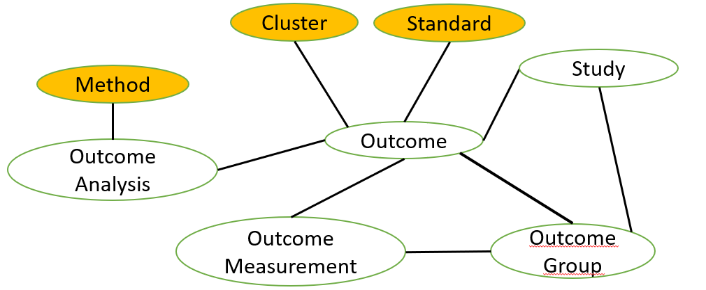
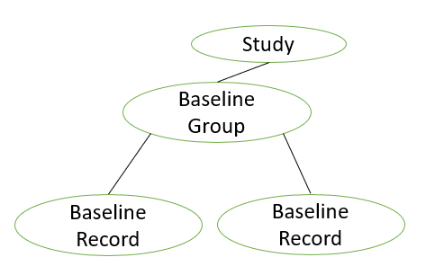
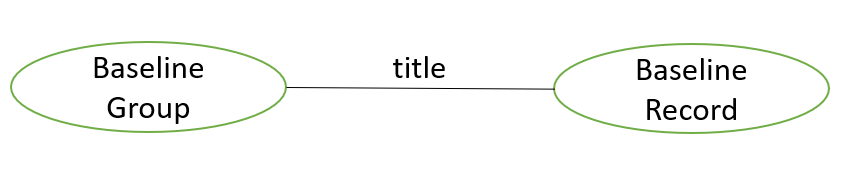
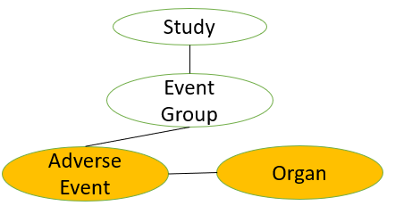

# Schema

# Nodes

Please refer to this [link][def] for detailed definition of attributes. We also list the definition of attributes which could be hard to understand. 

[def]: https://support.typora.io/Markdown-Reference/#reference-links

## Study

8,210 studies with 51 attributes.

**id**: The format is "StudyID:NCTXXX".

**label**: Study

**Attributes:**

1. **last_update_submitted_qc_date** 

   Example: 2020-04-10

2. **last_update_posted_date** 

   Example: 2020-04-21

3. **last_update_posted_date_type**: Actual/Estimate

   > Statistics:
   >
   > 4,424 (53.9%) Actual
   >
   > 3,786 (46.1%) Estimate

4. **start_month_year** 

   Example: "July 1, 2017"

5. **start_date_type**:  Actual/"" 

   > Statistics: 
   >
   > 5,774 (70.3%) ""
   >
   > 2,436 (29.7%) Actual

6. **start_date** 

   Example: 2017-07-01

7. **verification_month_year** 

   Example: April 2020

8. **primary_completion_month_year** 

   Example: 2020-04-30

9. **primary_completion_date_type** 

   Example: "July 15, 2018"

10. **primary_completion_date_type**: Actual/Anticipated/"" 

    > Statistics: 
    >
    > 8,188 (99.7%) Actual
    >
    > ​     19 "" 
    >
    > ​       3 Anticipated

11. **primary_completion_date**

    Definition: The date that the final participant was examined or received an intervention for the purposes of final collection of data for the primary outcome, whether the clinical study concluded according to the pre-specified protocol or was terminated. In the case of clinical studies with more than one primary outcome measure with different completion dates, this term refers to the date on which data collection is completed for all of the primary outcomes.

    Example: 2018-07-15

12. **target_duration**

    > Statistics: 
    >
    > 8,209 (99.9%) ""
    >
    > ​        1               7 Days

13. **study_type** 

    Definition: The nature of the investigation or investigational use for which clinical study information is being submitted.

    > Statistics: 
    >
    > 8,078 (98.4%) Interventional 
    >
    > ​    131   (1.6%) Observational       
    >
    > ​        1    (0.0%) Observational [Patient Registry]

14. **brief_title**

    Definition: A short title of the clinical study written in language intended for the lay public.

    Example: "Study of Naltrexone-Induced Blockade of Antidepressant Effects"

15. **official_title**

    Example: "Naltrexone-induced Blockade of Neural Responses Induced by Fast-Acting Antidepressant Effects"

16. **overall_status**: Completed/Terminated/Active, not recruiting/Unknown status/Recruiting 

    > Statistics: 
    >
    > 7,325 (89.2%) Completed
    >
    > 560 (6.8%) Terminated
    >
    > 311 (3.8%) Active, not recruiting
    >
    > ​     12 Unknown status
    >
    > ​       2 Recruiting

17. **last_known_status**: Active, not recruiting/""

18. **phase** 

    Definition: For a clinical trial of a drug product (including a biological product), the numerical phase of such clinical trial, consistent with terminology in 21 CFR 312.21 and in 21 CFR 312.85 for phase 4 studies.

    Example: Phase 3

    > Statistics:
    >
    > 3,507 (42.7%) Phase 3
    > 1,984 (24.2%) Phase 2
    > 1,409 (17.2%) Phase 4
    > 424   (5.2%) N/A
    > 345   (4.2%) Phase 1
    > 218   (2.7%) Phase 1/Phase 2
    > 175   (2.1%) Phase 2/Phase 3
    > 132   (1.6%) ""
    >   16   (0.2%) Early Phase 1

19. **enrollment**

    Definition:  The estimated total number of participants to be enrolled (target  number) or the actual total number of participants that are enrolled in  the clinical study.

    Example: 60

20. **enrollment_type**: Actual/Anticipated

    > Statistics: 
    >
    > 8,209 (99.9%) Actual
    >
    > ​        1 Anticipated

21. **source** 

    Example: University of Pittsburgh

    > Statistics: 
    >
    > 956 unique institutes in total
    >
    > 218 of them are in more than 5 institutes

22. **number_of_arms**

    Definition: The number of arms in the clinical trial. For a trial with multiple  periods or phases that have different numbers of arms, the maximum  number of arms during all periods or phases. "Arm" means a pre-specified group or subgroup of participant(s) in a  clinical trial assigned to receive specific intervention(s) (or no  intervention) according to a protocol. 

    Example: 2

23. **number_of_groups** 

    Example: 2

    > Statistics: 8,081(98.4%) ""

24. **why_stoped** 

    Example: "Lack of efficacy"

    > Statistics: 7,729 (94.1%) ""

25. **allocation**

    Definition: The method by which participants are assigned to arms in a clinical trial. 

    Example: "Randomized"   

    >  Statistics: 
    >
    >  7,019 (85.5%) Randomized
    >     602   (7.3%) N/A
    >     406   (4.9%) Non-Randomized (i.e., Participants may choose which group they want to be in, or they may be assigned to the groups by the    researchers.)
    >     183   (2.2%) ""

26. **intervention_model** 

    Definition: The strategy for assigning interventions to participants.

    Example: "Parallel Assignment" 

    > Statistics: 
    >
    > 6,308 (76.8%) Parallel Assignment (i.e., participants are assigned to one of two or more groups in parallel for the duration of the study)
    >    879 (10.7%) Single Group Assignment (i.e., clinical trials with a single arm)
    >    742   (9.0%) Crossover Assignment (i.e., groups of participants receive two or more interventions in a specific order.)
    >    167   (2.0%) ""
    >      93   (1.1%) Factorial Assignment (i.e., groups of participants receive one of several combinations of interventions)
    >      21   (0.2%) Sequential Assignment

27. **primary_purpose**

    Definition: The main objective of the intervention(s) being evaluated by the clinical trial. 

    Example: "Treatment"

    > Statistics:  
    >
    > 7,069 (86.1%) Treatment
    >    453   (5.5%) Prevention
    >    221   (2.7%) ""
    >    145   (1.8%) Basic Science
    >    138   (1.7%) Supportive Care
    >      93   (1.1%) Other
    >      71   (0.9%) Diagnostic
    >      16   (0.2%) Health Services Research
    >        4   (0.0%) Screening

28. **time_perspective**: Prospective/Retrospective/Cross-Sectional 

    > Statistics: 8,080 (98.4%) ""

29. **masking**

    Definition: The party or parties involved in the clinical trial who are prevented  from having knowledge of the interventions assigned to individual  participants. 

    Example: Double

    > Statistics:   
    >
    > 2,771 (33.8%) None (Open Label)
    > 1,986 (24.2%) Double
    > 1,982 (24.2%) Quadruple
    >    990 (12.1%) Triple
    >    310   (3.8%) Single
    >    171   (2.1%) ""

30. **masking_description**  

    Example: "This is a phase 4 double blind study, which will use a triple dummy design for dosing."

    > Statistics: 8,074 (98.3%) ""

31. **intervention_model_description** 

    Example:  "Phase I clinical trial, controlled, of parallel groups, double blind, randomized, exploratory."

    > Statistics: 8,080 (98.4%) ""

32. **subject_masked**: t/""

    Definition: True if participants are prevented from having knowledge of the interventions assigned to individual participants.

    > Statistics: 4,844 (59.0%) t and 3,366 (41.0%) ""

33. **caregiver_masked**: t/""

    Definition: True if caregivers are prevented from having knowledge of the interventions assigned to individual participants. 

    > Statistics: 2,614 (31.8%) t and 5,596 (68.2%) ""

34. **investigator_masked**: t/""

    Definition: True if investigators are prevented from having knowledge of the interventions assigned to individual participants.

    > Statistics: 4,718 (57.5%) t and 3,492 (42.5%) ""

35. **outcomes_assessor_masked**: t/""

    Definition: True if outcomes assessors are prevented from having knowledge of the interventions assigned to individual participants.

    > Statistics: 2,613 (31.8%) t and 5,597 (68.2%) ""

36. **sampling_method**: Probability Sample/Non-Probability Sample

    > Statistics: 8,078 (98.4%) ""

37. **gender**: All/Female/Male

    > Statistics: 
    >
    > 7,256 (88.4%) All
    >
    >    654   (8.0%) Female
    >
    >    300   (3.7%) Male

38. **minimum_age**

    Example: 18 Years

39. **maximum_age**

    Example:  65 Years

40. **healthy_volunteers**: No/"Accepts Healthy Volunteers"

    > Statistics: 
    >
    > 7,462 (90.9%) No
    >
    >    732  (8.9%) "Accepts Healthy Volunteers"
    >
    > ​     16 ""

41. **population** 

    Example: "Korean patients with T2DM"

    > Statistics: 8,078 (98.4%) ""

42. **criteria**

    Definition: A limited list of criteria for selection of participants in the clinical study, provided in terms of inclusion and exclusion criteria and suitable for assisting potential participants in identifying clinical  studies of interest. 

    Example: "~ Inclusion Criteria:  A subject must be 12 years of age or older, ..." (inclusion and exclusion criterion)

43. **gender_description** 

    Example: "Androgenetic Alopecia in Males"

    > Statistics: 8,198 (99.9%) ""

44. **gender_based**: t/"" (True of "")

    > Statistics: 29 t and 8,181 (99.6%) ""

45. **description** 

    Example: "The primary objective of the study is to determine whether armodafinil treatment..."

46. **id_type**: org_study_id/secondary_id/nct_alias

    > Statistics: 
    >
    > 8,210 (100%) studies have org_study_id 
    >
    > 4,078 (49.7%) studies have secondary_id
    >
    >    202   (2.5%) studies have nct_alias 

47. **id_value** 

    Example: "0000-072;2007_650"

48. **pmid** 

    Example: "15292498;11025867;16670414;1003364"

49. **reference_type**: reference/results_reference

    > Statistics: 
    >
    > 2,295 studies have 8,297 references (i.e., reference+results_reference). 
    >
    > 5,683 reference and 2,614 results_reference 
    >
    > Each study has 3.6 references on average.

## Drug

4,617 drugs with 3 attributes

**id**: The format is "DrugID:XXX"

**label**: Drug

**Attributes**:

1. **name** 

   Example: "bicalutamide"

## Standard Term

2,751 terms with 3 attributes

**id**: The format is "TermID:XXX"

**label**: Term

**Attributes**:

1. **name** 

   Example: "Bicalutamide"

## Condition

1,394 conditions with 3 attributes

**id**: The format is "ConditionID:XXX"

**label**: Condition

**Attributes**:

1. **name** 

   Example: "Fever"

## OutcomeSubgraph

### OutcomeGroup

32,499 outcome groups with 3 attributes

**id**: The format is "OutcomeGroupID:xxx".

**label**: OutcomeGroup

**Attributes:**

1. **ctgov_group**

2. **title**

   Example: "fMRI BOLD Responses in the rACC Cortex (Naltrexone vs Placebo)"

3. **description** 

   Example: "We examined naltrexone-induced changes in brain signal during the processing of contextual cues by extracting brain responses in the rACC and comparing then during the baseline (placebo only) and the naltrexone session using paired-t test statistical analysis."

### Outcome

88,386 outcomes with 5 attributes

**id**:  The format is "OutcomeID:xxx".

**label**: Outcome

**Attributes:**

1. **type**

   > Statistics:
   >
   > 70,171  (79.4%)  Secondary
   >
   > 15,534  (17.6%)  Primary
   >
   >   2,830    (3.2%)   Other Pre-specified Outcomes
   >
   > ​     289    (0.3%)   Post-Hoc

2. **title**

   Example: "Naltrexone-induced Changes in BOLD Responses in the rACC Cortex During the Processing of Contextual Cues"

3. **description**

   Example: "In order to identify naltrexone-induced changes in the neural correlates of contextual processing, ..."

4. **time_frame**

   Definition: Time point(s) at which the measurement is assessed for the specific metric used.

   Example: "[Approximately at day 1, 7]"

   

### StandardOutcome

492 standard outcomes with 1 attribute.

These standard outcomes are extracted from the abbreviations in the outcome titles and descriptions. Those unrelated outcomes have been manually filtered and those similar outcomes (e.g., "visual analog pain score" and "visual analogue pain scales") have been manually merged.

**id**: The format is "StandardOutcomeID:XXX".

**label**: StandardOutcome

**Attributes:**

1. **name**

   Example: "blood oxygen level dependent"

### ClusterOutcome

200 cluster outcomes with 5 attributes.

We first extracted from the outcome titles a set of words including noun, adv, verb and adj. Then, each outcome title is represented as the TF-IDF vector calculated from the extracted words. These TF-IDF vectors are further clustered into 200 clusters using the repeated bisection clustering algorithm in CLUTO. 

Among 88,386 outcome titles, 142 (0.16%) outcome titles with only abbreviations (e.g., "GAD-7" or "IL-6") cannot be clustered. 

**id**: The format is "ClusterOutcomeID:XXX".

**label**: ClusterOutcome

**Attributes:**

 1. **size**

    The size of clusters range from 86 to 1,493.

 2. **ISim**

    Definition: The average similarity between the objects of each cluster (i.e., internal similarities)

 3. **ESim**

    Definition: The average similarity of the objects of each cluster and the rest of the objects (i.e., external similarities).

 4. **discriptive**

    Definition: The set of five descriptive features is determined by selecting the columns that contribute the most to the average similarity between the objects of each cluster.

    Example:

    "circumference~56.4%,waist~43.0%,head~0.1%,abdominal~0.1%,change~0.1%"

 5. **discriminating**

    Definition: The set of five discriminating features is determined by selecting the columns that are more prevalent in the cluster compared to the rest of the objects.

    Example:

    "circumference~28.6%,waist~21.7%,survival~1.5%,response~1.4%,event~1.1%"

    

### OutcomeMeasure

690,626 outcome measurements with 9 attributes.

**id**: The format is "OutcomeMeasureID:XXX" in which the "XXX" is from the AACT database.

**label**: OutcomeMeasure

**Attributes:**

1. **classification**

   Example: "At week 24", "Interproximal analysis at week 24"

   Statistics: 142,515 (20.6%) ""

2. **category**

   Definition: "Name of distinct category or row for an outcome measure, if any."

   Example: "Yes"/"No","No flare up"/"Flare up", "Abnormal CS"/"Abnormal NCS".

   Statistics:  674,127 (97.6%) ""

3. **param_type**

   Definition: "The type of data for the outcome measure"

   > Statistics:
   >
   > 253,446      (36.7%)    Number
   >
   > 249,245      (36.1%)    Mean
   >
   >   76,099      (11.0%)    Least Squares Mean
   >
   >   64,858         (9.4%)    Count of Participants
   >
   >   31,243         (4.5%)    Median
   >
   >   14,703         (2.1%)    Geometric Mean
   >
   > ​        665        (0.1%)    Geometric Least Squares Mean
   >
   > ​        261                       Count of Units
   >
   > ​          45                       ""
   >
   > ​          39                        Log mean
   >
   > ​          22                        Other including "age normed" (6), "age & education normed" (6), "g/dL" (5), "ng/mL" (3), "age" (2).

4. **param_value**

5. **type_dispersion**

   > Statistics:
   >
   > 297,612    (43.1%)        "" (may means not applicable)
   >
   > 207,039    (30.0%)        Standard Deviation
   >
   >   98,956    (14.3%)        Standard Error
   >
   >   54,922      (8.0%)        95% Confidence Interval
   >
   >   11,984      (1.7%)        Full Range
   >
   > ​    8,837      (1.3%)        Inter-Quartile Range
   >
   > ​    8,620      (1.2%)        Geometric Coefficient of Variation
   >
   > ​    1,844      (0.3%)        90% Confidence Interval
   >
   > ​       633      (0.1%)        80% Confidence Interval
   >
   > ​       120                         97.5% Confidence Interval
   >
   > 
   >
   > Note that the measure of dispersion is not applicable only if Measure Type is "Number," "Count of Participants," or "Count of Units".

6. **dispersion_value**

7. **dispersion_lower_limit**

8. **dispersion_upper_limit**

9. **explanation_na**

   Definition: Explain why outcome measure data are not available, if "NA" is reported for Outcome Measure Data.

   

### OutcomeAnalysis

107,314 outcome analyses with 15 attributes.

**id**: The format is "OutcomeAnalysisID:XXX" in which the "XXX" is from the AACT database.

**label**: OutcomeAnalysis

**Attributes:**

1. **non_inferiority_type**

   Definition: Identifies the type of analysis.

   > Statistics:
   >
   > 73,743        (68.7%)          Superiority or Other
   >
   > 16,127        (15.0%)          Superiority
   >
   >   8,969           (8.4%)           Other
   >
   >   4,686           (4.4%)           Superiority or Other (legacy)
   >
   >   2,534           (2.4%)           Non-Inferiority or Equivalence
   >
   > ​     780           (0.7%)         Non-Inferiority
   >
   > ​     415           (0.4%)         Equivalence
   >
   > ​       60           (0.1%)         Non-Inferiority or Equivalence (legacy)

2. **non_inferiority_type_description**

3. **param_type**

   Example: "Mechanistic hypothesis: naltrexone will block contextual processing."

   > Statistics:
   >
   > 33,286         (31.0%)        ""
   >
   > 18,792         (17.5%)        Mean Difference (Final Values)
   >
   >   7,580           (7.1%)        LS Mean Difference
   >
   >   5,812           (5.4%)        Odds Ratio (OR)
   >
   >   5,429           (5.1%)        Mean Difference (Net)
   >
   >   5,054           (4.7%)        Hazard Ratio (HR)
   >
   >   
   >
   > 31,361         other types

4. **param_value**

   > Statistics:
   >
   > 33,286          (31.0%)       ""

5. **dispersion_type**

   > Statistics:
   >
   > 85,491          (79.7%)       ""
   >
   > 20,547          (19.1%)       Standard Error of the Mean
   >
   >   1,276               (1.2%)      Standard Deviation

6. **dispersion_value**

   > Statistics:
   >
   > 85,491          (79.7%)       ""

7. **p_value_modifier**

   > Statistics:
   >
   > 74,799          (69.7%)       ""
   >
   > 30,444          (28.4%)       <
   >
   >   1,027            (1.0%)        =
   >
   > ​     980            (0.9%)        >
   >
   > ​       64            "<=" (58); "p<" (3); ">=" (2); "NS" (1)

8. **p_value**

   > Statistics:
   >
   > 15,837          (14.8%)       "" 

9. **p_value_description**

   Example: 

10. **confidence_interval_sides**

    Definition: Select 1-sided or 2-sided.

    > Statistics:
    >
    > 62,041          (57.8%)          2-Sided
    >
    > 44,984          (41.9%)          ""
    >
    > ​      289            (0.3%)          1-Sided

11. **confidence_interval_percent**

    > Statistics:
    >
    > 65,209           (60.8%)         95.0
    >
    > 35,614           (33.2%)          ""
    >
    > 4,748              (4.4%)         90.0
    >
    > ​     726              (0.7%)         80.0
    >
    > 
    >
    > 1,017 other numbers

12. **confidence_interval_lower_limit**

    Definition: Required if confidence interval is "2-sided" or if confidence interval is "1-sided" and no Upper Limit is entered.

13. **confidence_interval_upper_limit**

    Definition: Required if confidence interval is "2-sided" or if confidence interval is "1-sided" and no Lower Limit is entered.

14. **estimate_description**

    Definition: Any other relevant estimation information, including the direction of the comparison (for example, describe which arm or comparison group represents the numerator and denominator for relative risk).

    Example: "Difference is first named treatment (experimental) minus second named treatment (control)."

15. **group_description**

    Example: "Changes in BOLD fMRI signal from the Placebo vs. the Naltrexone session."

16. **other_description**

    Example: "The primary analysis was based on concentration-QTc modeling of the relationship ..."

    

### Statistical Method

933 statistical methods with 1 attribute

**id**: The format is "MethodID:XX"

**label**: Method

**Attributes:**

1. **name**

   Example: ancova

## BaseSubgraph

### BaseGroup

27,068 outcome groups with 3 attributes

**id**: BaselineGroupID: ; 

**label**: BaselineGroup

**Attributes:**

1. **ctgov_group**

2. **title**

   Example: "Placebo, Then Naltrexone"

3. **description** 

   Example: ""In the placebo and then naltrexone arm, participants receive one-dose of placebo pill one hour before a first fMRI scanning session on visit 1 followed by a one-dose naltrexone 50mg one hour before a second fMRI scanning session on ...."

   

### BaselineRecord

315,533 baseline records with 12 attributes.

**id**: The format is "BaselineRecordID:XXX“ in which "XXX" is the ID from AACT database.

**label**: BaselineRecord

**Attributes:**

1. **classification**

   Example: "United States"; "Male"; "Female"

   > Statistics:
   >
   > 192,923         (61.1%)           ""

2. **category**

   Definition: Name of distinct category or row for a baseline measure, if any.

   Example:  "Unknown or Not Reported"; "Not Hispanic or Latino", "Hispanic or Latino","Male"

   > Statistics:
   >
   > 172,555          (54.7%)          ""

3. **units**

   Example: "participants", "years", "units on a scale"

   > Statistics:
   >
   > 256,681          (81.3%)          participants
   >
   >   26,116            (8.3%)           years
   >
   > ​    5,463            (1.7%)           units on a scale
   >
   > ​    2,075            (0.7%)           mg/dl
   >
   > 25,198     other

4. **param_type**

   > Statistics:
   >
   > 163,729          (51.9%)           count of participants
   >
   >   96,329          (30.5%)           number
   >
   >   50,326          (15.9%)           mean
   >
   > ​    4,940            (1.6%)           median
   >
   > ​          98                                  count of units
   >
   > ​          64                                  geometric mean
   >
   > ​          41                                  least squares mean
   >
   > ​            6                                  log mean

5. **param_value**

6. **dispersion_type**

   > Statistics:
   >
   > 260,156          (82.4%)           ""
   >
   >   49,188          (15.6%)           Standard deviation
   >
   > ​    3,751            (1.2%)           Full range
   >
   > ​    2,438            (0.8%)           Inter-quartile range

7. **dispersion_value**

   > Statistics:
   >
   > 266,061          (84.3%)            ""

8. **dispersion_lower_limit**

   Definition: Used for reporting the lower limit of the interquartile range or full range.

9. **dispersion_upper_limit**

   Definition: Used for reporting the upper limit of the interquartile range or full range.

10. **explanation_of_na**

## EventSubgraph

### EventGroup

20,599 event groups with 3 attributes

**id**: The format is "EventGroupID:XXX" in which "XXX" is the ID from AACT database.

**label**: EventGroup

**Attributes:**

1. **ctgov_group**

   Example: E2

2. **title**

   Example: "Naltrexone"

3. **time_frame**

   Definition: The specific period of time over which adverse event data were collected.

   Example: "[Approximately at day 1, 7]"

4. **description** 

   Example: "Naltrexone 50 Mg Oral Tablet: Naltrexone hydrochloride (ReVia. Toronto, ON: Teva Canada Limited; 2015)..."

5. **num_participants**

   Example: 24

6. **num_serious**

   Definition: Number of participants with serious adverse events.

   Example: 0

7. **num_other**

   Definition: Number of participants with other adverse events.

   Example: 14

8. **num_mortality**

   Definition: Number of all anticipated and unanticipated deaths due to any cause.

   Example: 0

### AdverseEvent

12,640 adverse events with 5 attributes.

Note that instead of directly using the terms in the dataset, we tried to normalize them so that these terms can match with the **Medical Dictionary for Regulatory Activities (MedDRA) Terminology**. Please see https://www.meddra.org/ for details. 

> The structure of MedDRA is very logical. There are five levels to the MedDRA hierarchy, arranged from very specific to very general. At the most specific level, called “Lowest Level Terms” (LLTs), there are more than 70,000 terms which parallel **how information is communicated.** These LLTs reflect how an observation might be reported in practice. This level directly supports assigning MedDRA terms within a user database.
>
> Each member of the next level, “Preferred Terms” (PTs), is a distinct descriptor **(single medical concept)** for a symptom, sign, disease diagnosis, therapeutic indication, investigation, surgical or medical procedure, and medical social or family history characteristic. Each LLT is linked to only one PT. Each PT has at least one LLT (itself) as well as synonyms and lexical variants (e.g., abbreviations, different word order).
>
> from https://www.meddra.org/how-to-use/basics/hierarchy

Before normalization, the original database contains 42,435 unique adverse event terms.  In addition, for those terms with level "LLT", we mapped them to their corresponding preferred terms. 

**id**: the format is "AdverseEventID:XXX"

**label**: AdverseEvent

**Attributes:**

1. **term_name**

   Example: "nodule, pulmonary"; "diarrhea-no colostom"

2. **medDRA_code**

   Definition: The corresponding MedDRA code of the term.

   Example: "10003205", "0"

   > Statistics:
   >
   > 10,176          (80.5%)           0 (terms cannot be normalized to match with the MedDRA terms)
   >
   >   2,464          (19.5%)           MedDRA code

3. **term_type**

   Definition: The corresponding MedDRA level of the term.

   > Statistics:
   >
   > 10,176         (80.5%)         None
   >
   >   2,309         (18.3%)         PT
   >
   > ​     134            (1.1%)        HLT
   >
   > ​       21            (0.1%)        HLGT

4. **high_level_term**

   Definition: The corresponding high level term of the adverse event term (from MedDRA dictionary)

5. **high_group_level_term**

   Definition: The corresponding high group level term of the adverse event term (from MedDRA dictionary)

   

### Organ

27 outcomes with 1 attribute.

Definition: High-level categories used to group adverse event terms by body or organ system.

**id**: The format is "OrganID:XXX"

**label**: Organ

**Attributes:**

1. **name**

   Example: "Ear and labyrinth disorders", "Vascular disorders"

## DropSubgraph

### DropGroup

22,272 drop groups with 3 attributes

**id**: The format is "DropGroupID:XXX"  in which "XXX" is the ID from AACT database.

**label**: DropGroup

**Attributes:**

1. **ctgov_group**

   Example: P2

2. **title**

   Example: "Placebo, Then Naltrexone"

3. **description** 

   Example: "In the placebo and then naltrexone arm, participants receive one-dose of placebo pill one hour before a first fMRI scanning session..."

### Period

34,330 Periods with 10 attributes.

Definition: Discrete stages of a clinical study during which numbers of participants at specific significant events or points of time are reported.

There is no limit to the number of periods that may be used to describe a single study. Each subsequent period represents a study stage following the previous period. That is, participants "flow" from earlier to later periods. 

> Among 34,330 periods,
>
> Number of periods, Count 
>
> 27,578 (80.3%),             3     (STARTED/NOT COMPLETED/COMPLETED)
>
>   4,662 (13.6%),             4
>
>   1,168   (3.4%),             5
>
> ​     553   (1.6%),             6

**id**: The format is "PeriodID:XXX".

**label:** Period

**Attributes:**

1. **period**

   Definition: period title.

   Example: "Second Intervention (1day)"; "Washout (1 Week)"

   > Statistics:
   >
   > 2,992 unique period titles.
   >
   > Top 5 most frequent period titles:
   >
   > Number of periods, Number of drop records, name
   >
   > 16,151 (47.0%)           65,468 (53.0%)           Overall Study
   >
   > ​      427  (1.2%)                  755  (0.7%)           Period 2
   >
   > ​      396  (1.1%)                  827  (0.6%)           Period 1
   >
   > ​      260  (0.8%)                1,868  (1.5%)          Treatment Period
   >
   > ​      217  (0.6%)                   616  (0.5%)          Treatment Period 1

2. **num_started**

   Definition: Number of participants initiating the period. In the first period, it is the number of participants assigned to each arm or group.

3. **started_description**

   Definition: Additional information about the Started milestone or Milestone Data.

   Example: "All participants received all of the 4 interventions"

   > Statistics:
   >
   > 30,877         (89.9%)           ""
   >
   >   3,453         (10.1%)           any description

4. **num_not_completed**

   Definition: Number of participants (and units, if applicable) that did not complete the study or period. This is calculated automatically by subtracting Completed from Started. 

   This calculated number doesn't have the associated description.

5. **num_completed**

   Definition: Number of participants at the end of the period.

6. **completed_description**

   Example: "Postoperative day one pain score not available for one patient"

   > Statistics:
   >
   > 32,417        (94.4%)           ""
   >
   >   1,913           (5.6%)          any description

7. **additional_count**

   Definition: Any specific events or time points in the study when the numbers of participants (and units, if applicable) are reported. 

   Note that we combined all the additional count of participants into one entry. The format of that entry is "name~count~name~count....". 

   Example: "Switched to Pembrolizumab~4~Treated~15~"

   > Statistics:
   >
   > 27,665        (80.6%)          ""
   >
   >   6,665        (19.4%)          any additional count

8. **additional_description**

   Example: "~~" or "Row represents Ixekizumab data only.~Row represents Ixekizumab data only."

   > Statistics:
   >
   > 33,430       (97.4%)          "" (no additional counts) or "~~~" (have additional counts but no additional description)
   >
   > ​     900         (2.6%)

### DropRecord

123,627 drop records with 2 attributes.

**id**: The format is "DropRecordID:XXX".

**label:** DropRecord

**Attributes:**

1. **reason**

   Definition: Additional information about participants who did not complete the study or period.

   Example: "Lost to Follow-up", "Withdrawal by Subject"

   > 6,424 unique dropout reasons
   >
   > Top 5 most frequent dropout reasons:
   >
   > 17,262 (13.96%)      Withdrawal by Subject
   >
   > 16,782 (13.57%)      Adverse Event
   >
   > 14,287 (11.55%)      Lost to Follow-up
   >
   >   8,794   (7.11%)      Protocol Violation
   >
   >   7,213   (5.83%)      Lack of Efficacy

2. **count**

   

   

# Relations

## study and used drug

There are 29,428 edges between studies and the drugs used in the study. This relation indicates which drugs are used in the study. The used drugs are the drugs found in the intervention or group title/description of the study.

1. id: Study::UsedDrug::0
2. label: study::usedDrug
3. from: StudyID:NCT00000378
4. to: DrugID:85

## Study and studied drug

There are 23,308 edges between studies and studied drugs. This relation indicates which drugs are studied in the study. The studied drugs are the drugs only from the group title/description of the study. All the studied drugs are also used drugs.

1. id: Study::StudiedDrug::0
2. label: study::studiedDrug
3. from: StudyID:NCT00000378
4. to: DrugID:85

## Study and Condition

There are 17,259 edges between studies and conditions. This relation indicates the conditions studied in the study.

1. id: Study::Condition::0
2. label: study::condition
3. from: StudyID:NCT02761980
4. to: ConditionID:0

## Drug and standard term

There are 4,617 edges between drug and standard term. One drug is associated with a drug name. Since multiple drug names may be for the same standard drug. We normalize the drug names with the standard terms.

1. id: drug::term:0
2. label: drug::term
3. from: DrugID:0
4. to: TermID:0

**Note: ** in the database, each relation will have an inverse relation to make the edge double directed. For example, between the study A and condition B, we will have an edge A->B with label Study::Condition and an edge B->A with label Condition::Study. Relations have the same attributes and statistics (e.g., number of edges in the relation) with their inverse relation.

## Outcome Subgraph

### Study and OutcomeGroup 

There are 22,272 edges between study and outcomegroup.

**id**: The format is "study::outcomegroup:XXX".

**label**:  study::outcomegroup

**from:** StudyID:XXX

**to:**  OutcomeGroupID:XXX

### Study and Outcome

There are 88,386 edges between study and outcomegroup.

**id**: The format is "study::outcome:XXX".

**label**:  study::outcome

**from:** StudyID:XXX

**to:**  OutcomeID:XXX

### Outcome and ClusterOutcome

There are 88,244 edges between outcome and clusteroutcome.

**id**: The format is "outcome::clusteroutcome:XXX".

**label**:  outcome::clusteroutcome

**from:** OutcomeID:XXX

**to:**  ClusterOutcomeID:XXX

### Outcome and StandardOutcome

There are 57,910 edges between 37,735 unique outcomes and 492 standard outcomes.

**id**: The format is "outcome::standardoutcome:XXX".

**label**:  outcome::standardoutcome

**from:** OutcomeID:XXX

**to:**  StandardOutcomeID:XXX

### Outcome and OutcomeAnalysis

There are 107,314 edges between 45,707 unique outcomes and 107,314 outcome analyses.

**id**: The format is "outcome::outcomeanalysis:XXX".

**label**:  outcome::outcomeanalysis

**from:** OutcomeID:XXX

**to:**  OutcomeAnalysisID:XXX

### OutcomeAnalysis and Method

There are 107,314 edges between 45,707 unique outcomes and 107,314 outcome analyses.

### Outcome and OutcomeMeasurement

### Outcome and OutcomeGroup

### OutcomeMeasurement and OutcomeGroup

### 

## Baseline Subgraph

### Study and BaselineGroup 

There are 22,272 edges between study and baselinegroup.

## Event Subgraph

## Drop Subgraph

